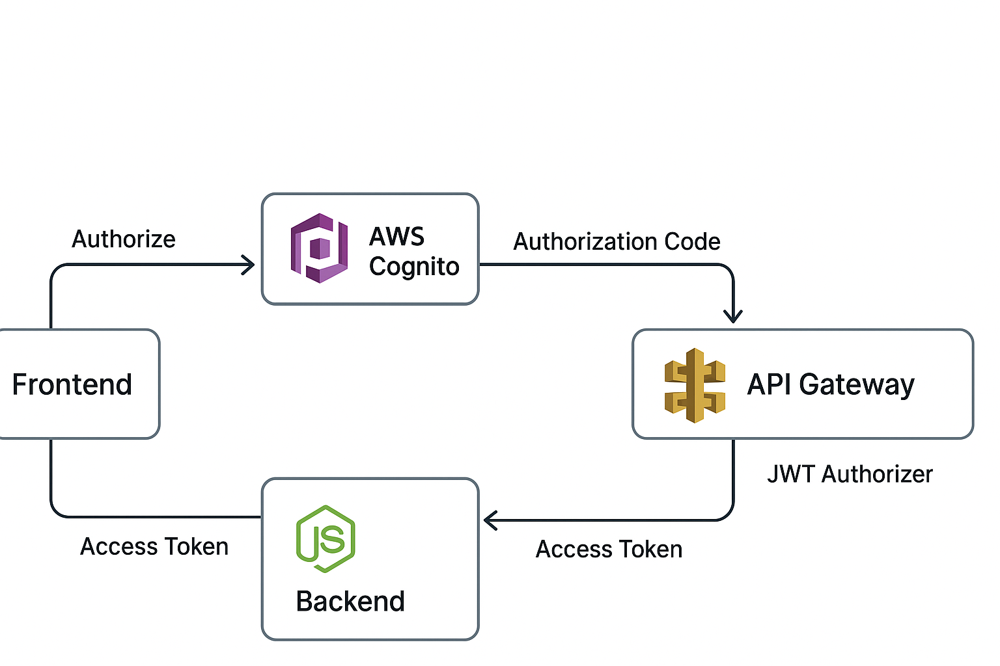

# AWS Cognito OAuth2 + API Gateway JWT Authorizer (End-to-End Authentication)

## 📌 Project Overview

This project demonstrates a **real-world authentication and authorization architecture** using:

- **OAuth 2.0 Authorization Code Flow with PKCE**
- **AWS Cognito User Pools**
- **API Gateway HTTP API with JWT Authorizer**
- **Node.js backend with scope-based authorization**

Authentication and JWT validation are handled at the **API Gateway layer**, while **fine-grained authorization (scopes)** is enforced inside the backend service.

This mirrors how authentication is implemented in **production-grade cloud systems**.

---

## 🧱 Architecture Diagram



---

## 🔐 Authentication & Authorization Flow

1. User accesses the **Frontend (SPA)**
2. User is redirected to **AWS Cognito Hosted UI**
3. Login happens using **OAuth 2.0 Authorization Code Flow with PKCE**
4. Cognito issues an **Access Token (JWT)**
5. Frontend calls API Gateway with:

## Authorization: Bearer <access_token>

6. **API Gateway JWT Authorizer** validates:
- Token signature
- Issuer (Cognito User Pool)
- Audience (App Client ID)
7. Valid requests are forwarded to the backend
8. Backend enforces **scope-based authorization**
- Example: `order-api/read`

---

## 🧠 Key Design Principles

- ✅ Token validation happens at the **edge (API Gateway)**
- ✅ Backend remains **stateless and clean**
- ✅ Zero-trust model — unauthorized requests never reach backend
- ✅ Clear separation of **authentication vs authorization**

---

## 🧪 Example API Test (curl)

```bash
`curl -H "Authorization: Bearer <ACCESS_TOKEN>" \
https://<API_GATEWAY_INVOKE_URL>/orders`


## ✅ Valid Token Response
`{
  "message": "Orders read allowed"
}`

## ❌ Missing / Invalid Token
`{
  "message": "Unauthorized"
}`

## 📂 Project Structure

`frontend/
 ├── index.html
 └── callback.html

backend/
 ├── routes/
 │   └── orders.js
 ├── middleware/
 │   └── authorize.js
 ├── server.js
 ├── Dockerfile
 └── package.json

docs/
 └── architecture.png`
---
 ## 🔑 Security Features Implemented
- **OAuth 2.0 Authorization Code Flow with PKCE**
- **OpenID Connect (OIDC)**
- **Cognito-issued JWT access tokens**
- **API Gateway JWT Authorizer (Issuer + Audience validation)**
- **Scope-based authorization in backend**
- **Secure token forwarding via Authorization header**

## 🚀 What This Project Demonstrates
- **Real-world OAuth2 + OIDC implementation**
- **AWS Cognito User Pools**
- **API Gateway HTTP API**
- **JWT Authorizer usage**
- **Backend authorization best practices**
- **Frontend-to-backend secure communication**

## 🔮 Possible Enhancements
- **HTTP-only cookies (BFF pattern)**
- **Refresh token rotation**
- **Custom domain for API Gateway**
- **AWS WAF and rate limiting**
- **Infrastructure as Code (Terraform)**
---
## ✅ Project Status
Completed
This project is production-ready and suitable for showcasing OAuth2, Cognito, and API Gateway expertise.

## 👤 Author
Tamiri Ram Kumar
Aspiring DevOps / AWS Cloud Engineer


